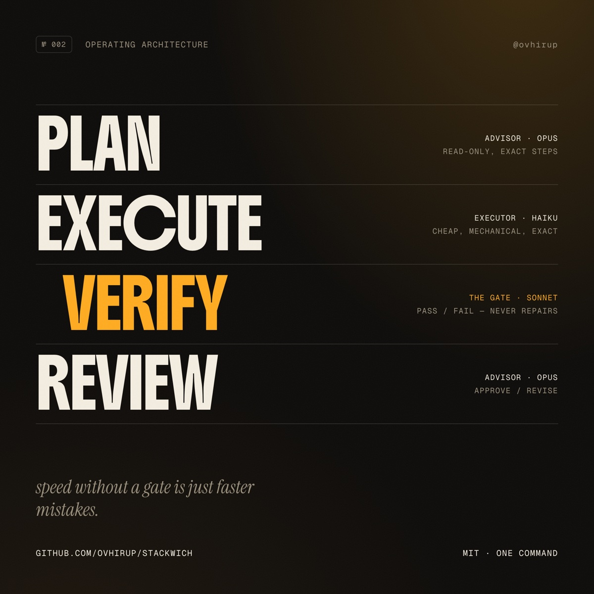

# 🥪 stackwich

[](https://github.com/ovhirup/stackwich/actions/workflows/validate.yml)
[](LICENSE)
[](https://docs.claude.com/en/docs/claude-code/skills)

**Delivery discipline for AI agents. Five layers, one command.**

Most people run AI coding agents like slot machines: prompt → pull the lever → hope. The agent writes code 10× faster than you review it, declares itself done, and you find out later. We would never accept that from a junior engineer — we accept it from our tools every day.

Stackwich is 15 years of delivery coaching — plan → build → test → review, the oldest idea in software — compressed into standing policy for [Claude Code](https://docs.claude.com/en/docs/claude-code). Install it once and every future session works this way.



## The five layers

| Layer | Habit |
|---|---|
| **Prompt** | Meta-prompt every delegation. Context-full, with a stated done condition. Understanding never gets delegated. |
| **Context** | Fork research and read-heavy scans off the main thread. Memory, plans, and tasks each do their own job. |
| **Harness** | One writer. Read-only enforced in practice, not just in the tool list. Nothing "done" until observed. |
| **Loop** | Recurring work runs on `/loop`. Failure loops are capped at 2 cycles and never silent. |
| **Graph** | `advisor` plans → `executor` implements → `verifier` gates → `advisor` reviews, with explicit hand-off contracts. |

Cost discipline isn't a sixth layer — it's how the five are practiced: cheap models grind, expensive models only plan and review, and nothing already established gets re-derived.

The layer names are structure for the humans auditing the setup. Inside the installed policy block they're section headers only; every bullet under them is a behavioral imperative, because that block is read on every turn and prose explaining a taxonomy would cost tokens without changing an action.

## The sandwich

| Stage | Agent | Model | Contract |
|---|---|---|---|
| 🍞 **Plan** | `advisor` | opus | Read-only. Exact files, exact edits, a verification command per step. Flags anything irreversible. |
| 🥩 **Execute** | `executor` | haiku | Mechanical and exact. No redesigns, no improvising, no suffixed file copies. |
| 🧪 **Verify** | `verifier` | sonnet | Runs the project's real tests/lint/build. `GATE: PASS` or `GATE: FAIL` — never repairs. |
| 🍞 **Review** | `advisor` | opus | Diff vs. plan, conventions, blast radius. `APPROVE` or `REVISE: <list>`. |

Small, reversible changes skip the ceremony — the verifier alone closes the loop. If the same verification fails twice, iteration stops and escalates to the advisor. Speed without a gate is just faster mistakes.

## Install

Add the marketplace, then install the plugin. Both are slash commands, typed inside a Claude Code session:

```
/plugin marketplace add ovhirup/stackwich
/plugin install stackwich@stackwich
```

Then, inside any Claude Code session:

```
/stackwich
```

The skill does the rest interactively: asks for scope, writes the policy, offers the three agents. Run `/agents` afterwards to confirm `advisor`, `executor`, and `verifier` are picked up. Re-running it on an existing install detects the marker and offers an in-place upgrade.

### Upgrading from 2.x

Before 3.0, Stackwich was installed by cloning this repo into `~/.claude/skills/stackwich`. That is no longer how it is delivered, and leaving the old directory in place gives you two skills both named `stackwich`. Remove it after installing the plugin:

```bash
rm -rf ~/.claude/skills/stackwich
```

**Nothing about your policy changes.** Your `CLAUDE.md` block stays at `policy-rev 3`, your `advisor`, `executor` and `verifier` keep their existing names and contents, and there is nothing to re-run. Only the delivery mechanism moved.

## What it writes

| Path | What |
|---|---|
| `<scope>/CLAUDE.md` | The operating policy, fenced between `<!-- stackwich:v1 -->` markers — updates in place, never duplicates |
| `<scope>/agents/advisor.md` | Read-only planner/reviewer (opus) |
| `<scope>/agents/executor.md` | Cheap mechanical executor (haiku) |
| `<scope>/agents/verifier.md` | PASS/FAIL verification gate (sonnet) |

`<scope>` is `~/.claude` (user level — every project, the recommended default) or `./.claude` (this project only). Already have your own plan/execute/verify agents? Keep them — Stackwich is the policy; the three files are just a default implementation, and the installer handles name collisions.

## Design notes

**The marker never changes.** `<!-- stackwich:v1 -->` is the permanent search key; the actual revision lives on a `policy-rev` comment inside the block. If the marker were versioned, a newer release couldn't find older installs to upgrade. The rule binds each port to whatever marker it shipped with: `grok/` reuses `stackwich:v1`, while `codex/` writes `<!-- stackwich-codex:v1 -->` to `AGENTS.md` and keeps it — renaming a marker that is already installed somewhere is precisely the upgrade break this rule exists to prevent.

**Single writer.** Only `executor` mutates the filesystem. `advisor` and `verifier` have `Bash` for inspection and verification, explicitly scoped away from writes — a fix from a reviewer is an unreviewed change nobody knows exists.

**Loops are capped.** `GATE: FAIL` and `REVISE:` both route back to `executor` with the original plan attached, for at most 2 cycles. On the third, it stops and surfaces everything to the human. Verdict lines are fixed strings so the routing is mechanical, not interpretive.

**Input contracts are explicit.** Each agent states what it must receive and is instructed to stop when a piece is missing rather than reconstruct it — a reviewer that rebuilds the plan from the diff reviews the change against itself and approves anything self-consistent.

## Repo layout

```
stackwich/
├── .claude-plugin/
│   └── marketplace.json          # the marketplace catalog
├── plugins/stackwich/
│   ├── .claude-plugin/
│   │   └── plugin.json           # the plugin manifest
│   ├── LICENSE
│   └── skills/stackwich/
│       ├── SKILL.md              # the skill: install workflow + policy block
│       └── assets/               # agent definitions, read only when scaffolding is accepted
│           ├── advisor.md
│           ├── executor.md
│           └── verifier.md
├── evals/evals.json              # test cases for the five install paths
├── docs/sandwich.jpg
├── grok/                         # Grok port (stackwich-grok) — not a Claude Code skill
├── codex/                        # Codex port (stackwich-codex) — not a Claude Code skill
├── CHANGELOG.md
├── LICENSE
└── README.md
```

`assets/` is kept out of `SKILL.md` deliberately: progressive disclosure. The agent definitions are ~150 lines that don't need to enter context on every trigger, and never at all when the user declines the scaffolding.

## Uninstall

```
/plugin uninstall stackwich
/plugin marketplace remove stackwich
```

The agents were scaffolded into your own `~/.claude/agents/`, not shipped by the plugin, so removing the plugin leaves them behind. Delete them separately if you want them gone:

```bash
rm -f ~/.claude/agents/{advisor,executor,verifier}.md
```

…and delete the `<!-- stackwich:v1 -->` … `<!-- /stackwich:v1 -->` block from your `CLAUDE.md`.

## FAQ

**Does it audit my existing code?** No. It's forward-looking policy — it changes how future work gets done, nothing retroactive.

**Will it slow me down?** Only where slow is the point. Small, reversible edits run exactly as before; the full sandwich fires only when a change is hard to reverse, touches shared systems, or spans repos.

**Why these three models?** Tiering is the cost control: opus judgment where it pays (plan/review), haiku hands where it doesn't (mechanical edits), sonnet in between as the gate. Swap models in the agent frontmatter if your stack differs.

## Author

Built by **Abhirup Banerjee** ([@ovhirup](https://github.com/ovhirup)) — AI-native Agile coach; SAFe, PI Planning, and large BFSI delivery programs. Stackwich is that delivery discipline, ported to agents.

MIT — see [LICENSE](LICENSE). Forks and mirrors welcome — please keep the attribution lines in `SKILL.md` and the agent files intact. If it saves you a bad merge, a ⭐ is appreciated.
